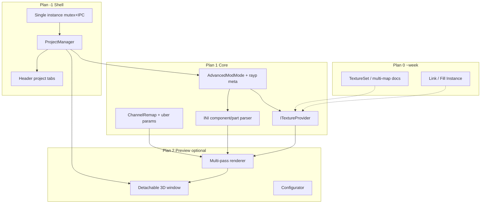

# Advanced Mod Mode · ProjectManager · Cross-Texture · 3D Preview

**Date:** 2026-07-10 (rev 3 — shell implementation started)  
**Status:** Plan −1 partially **implemented** (ProjectManager + single instance + header tabs). Plans 0–2 still pending.  
**References:**
- `research/xxmi_research.md` — INI / `.buf` / `.ib` geometry
- `research/zzz-materials/` — ZZZ character pipeline + decompiled HLSL
- Substance Painter — UX reference (channel packing inverse, materials)
- Current: `Canvas::ProjectType { Simple, Advanced }`, single `g_Canvas`, multi-process launches possible

---

## Product intent (locked)

| Decision | Detail |
|----------|--------|
| **Single instance** | One running app process (Photoshop-like). Second launch focuses existing window / opens path in it |
| **ProjectManager** | Multiple open projects in one process; switch via **hard-wired header tabs** |
| Paint stays 2D | 3D is **preview only** — never blocks 2D workflow |
| 3D UI | **Optional detachable window** — can stay closed forever |
| 3D fidelity | Frame-dump-driven multi-pass foundation (main → optional glow → global outline/bloom later) |
| Goal of 3D | Judge Diffuse / LightMap / MaterialMap / NormalMap **in-game-ish** while painting 2D |
| Geometry source | XXMI `.ini` + optional dump path (`hash.json` + dump files). **Geometry may be absent** (face/hash-only texture mods) |
| Skinning | **Ignored** |
| Game CB fidelity | Not recreated; editor owns camera/light; lighting curves from adapted presets |
| Abstraction | 3D module isolated (interfaces + SRVs in, RTV out) |
| Project type | **`AdvancedModMode`** (3rd type). Stored in `.rayp` + new meta fields |
| Target games | **ZZZ + GI** first. HSR deprioritized (hash-only texture mods; may reuse GI-like templates later) |
| Texture bind priority | **Named API / Resource commands first**; rare `ps-tN` exceptions (e.g. t69 opacity, t70 glow / RabbitFX) |
| Shader model | **One configurable uber shader** (not many hard-coded binaries); channel remap + feature params |
| Link / Fill Instance | ~1 week after preview MVP — Plan 0, not day-1 |

---

## Plan map

| Plan | Name | Blocks 3D MVP? | Purpose |
|------|------|----------------|---------|
| **−1 / Shell** | Single instance + **ProjectManager** + header project tabs | **Yes (for multi-project shell)** | Process model; replace “N× exe” with “N projects” |
| **0** | Cross-texture 2D kernel | **No** | Texture sets, links, fill, multi-map paint |
| **1** | Core for 3D + AdvancedModMode | **Yes** | Meta, providers, INI/dump model, channel remap |
| **2** | 3D Preview module | **Yes (optional feature)** | Multi-pass viewport + settings + configurator |

**Practical order:** Shell (−1) early (unblocks everything) → Plan 1 slice → Plan 2 → Plan 0 (~week).

MVP for “3D preview works”: **−1 (enough to host one project cleanly)** + **1** + **2**. Multi-project tabs can ship with −1 even before 3D.

---

# Plan −1 — Single instance + ProjectManager + header tabs

> Outside the original 0/1/2 split, but **foundational**. Today: one `g_Canvas`, second launch = second process. Target: one process, many projects, Photoshop-like tabs.

## −1.1 Single instance (Windows)

| Mechanism | Notes |
|-----------|--------|
| Named mutex | e.g. `Local\RayVPaint_SingleInstance` (or per-user GUID) at process start |
| If mutex exists | Find main HWND → `SetForegroundWindow` / restore if minimized |
| IPC for path | `WM_COPYDATA` or named pipe: second process sends file path(s) then exits |
| CLI | `rayvpaint.exe file.rayp` on warm start → open/activate project tab in running instance |
| Headless / tests | Escape hatch: `--allow-multi-instance` or `--headless` skips mutex (CI) |

**Do not** spawn `RayVPaintCore.exe` / console launcher as a second editor instance for “another document”.

## −1.2 ProjectManager (core)

Replaces mental model `g_Canvas` → **manager of projects**.

```
ProjectManager
├── projects[]: unique_ptr<Project>
├── activeProjectId
├── Open / Close / Switch / Save / SaveAll
└── Request paths from OS / D&D / IPC
```

### What is a `Project`?

| Field | Role |
|-------|------|
| `id` | Stable runtime id |
| `displayName` | Tab title (filename or “Untitled-N”) |
| `projectType` | Simple / Advanced / **AdvancedModMode** |
| `filePath` | `.rayp` or source image path (may be empty if unsaved) |
| `dirty` | Unsaved marker on tab |
| `document(s)` | Simple/Advanced: one Canvas-like doc. AdvancedMod: N map docs (Plan 0/1) |
| `modPreview` | Optional: ini/dump paths, scene cache — **null if unused** |
| `uiState` | Per-project: zoom/pan, active layer, tool-local? (policy TBD) |

**Brush / global tools:** shared app-level (like PS tool settings) unless we later add per-project brushes.

### Active project routing

All paint/UI entry points:

```cpp
Canvas& ProjectManager::ActiveCanvas(); // or Document&
// main.cpp / EditorPanels never hold a naked global Canvas forever
```

Undo stacks are **per project** (never cross-contaminate).

### Memory policy

| Rule | Detail |
|------|--------|
| Active project | Full GPU composite hot |
| Inactive projects | Keep tile CPU/storage; **may drop** large GPU layer textures / composite until re-activated |
| Close project | Prompt if dirty; free all |
| Cap (optional later) | Soft warn at N open 16K projects |

## −1.3 Header project tabs (UI — hard-wired)

Not a free-floating ImGui dock tab bar for projects — **fixed in application header/chrome**:

```
[ File Edit ... ]   [ Untitled-1 ● ] [ Belle.rayp ] [ Skin.dds ]  [+]
                     └──────────── project tabs (always visible) ──┘
```

| Behavior | Detail |
|----------|--------|
| Click tab | `SwitchProject(id)` |
| Middle-click / × | Close (confirm if dirty) |
| `+` | New project wizard (type picker) |
| Drag reorder | Optional v1 |
| Dirty | Dot / asterisk on title |
| Double-click tab | Rename? optional later |
| Context menu | Close / Close Others / Reveal in Explorer / Copy path |

**Separation of concerns:**

| UI strip | Meaning |
|----------|---------|
| **Header project tabs** | Open *projects* (files) — Plan −1 |
| **In-project map tabs** (later) | Diffuse / LightMap / … inside AdvancedModMode — Plan 0/1 |

Do not merge these two concepts into one bar.

## −1.4 Implementation phases (−1)

| Phase | Deliverable |
|-------|-------------|
| −1.A | Mutex + focus existing window + IPC open path |
| −1.B | `ProjectManager` with 1 project (refactor `g_Canvas` behind manager) |
| −1.C | Multi-project open/close/switch + per-project undo |
| −1.D | Header tab bar UI hard-wired |
| −1.E | Inactive project GPU demote (optional, after stability) |

---

# Plan 0 — Cross-texture 2D kernel (future, ~1 week post-preview)

> Link / Fill Instance: **ok ~1 week later**. Not critical for 3D preview if maps bind via docs or DDS paths.

## 0.1 Texture Set / Document Graph

```
Project (AdvancedModMode)
├── TextureSet / Material "BodyA" or "BodyA.Part0"
│   ├── Diffuse, LightMap, MaterialMap, NormalMap → Documents
├── ...
└── optional PreviewConfig (ini, dump, bindings)
```

Maps **may differ in resolution** (e.g. Normal 1K, Diffuse 2K) or even 4×4 solid / non-square. Core must not assume equal sizes. 3D samples each SRV with its own size/UV; 2D editor never forces unified canvas size across maps.

## 0.2 Link & Fill Instance

| Mode | When |
|------|------|
| SoftLink / ChannelLink | First (~week) |
| Hard shared tiles | Only if needed |
| Fill Instance | With Fill layers |

## 0.3 Rest (unchanged intent)

Fill layers, tiled masks, smart objects, multi-map paint targeting — see earlier revision; still Plan 0.

---

# Plan 1 — Core prerequisites for 3D + AdvancedModMode

## 1.1 Project type

```cpp
enum class ProjectType {
    Simple,
    Advanced,
    AdvancedModMode
};
```

Persisted in `.rayp` as today (`project_type`), extended:

```json
{
  "project_type": "advanced_mod",
  "mod": {
    "ini_path": "...",
    "dump_path": "...",
    "preview_enabled_once": true,
    "last_shader_params": { },
    "texture_sets": [ ],
    "component_overrides": [ ]
  }
}
```

| Rule | Detail |
|------|--------|
| Open anywhere | `.rayp` always opens as 2D project |
| Broken ini/dump | **No crash** — log + banner “Preview unavailable”; paint works |
| 3D optional | Missing mod block = Advanced-like 2D only |

## 1.2 INI / component / part model (from modder answers)

**Usually:** 1 character ≈ 1 main INI. Helper INIs exist but treat as separate resources if needed; primary workflow = one INI path.

### Hierarchy (critical)

```
Component "BelleBodyA"          // or unnamed / name = "Parts" only
├── shared VB resources: vb0/vb1/vb2  (Position / Blend / Texcoord — same for all parts)
├── Part 0  (or single-part component)
│   ├── own IB range / own IB resource
│   ├── own textures (API binds)
│   ├── own material / shader params
│   └── drawindexed range(s)
├── Part 1
│   └── different IB / textures / material, SAME vb buffers
└── ...
```

| Case | Handling |
|------|----------|
| `component` + `component.part` | Each **part = material unit** (visibility, textures, shader config) |
| Unnamed component / named only `Parts` | Still emit part materials with stable generated ids |
| Single-part component | One material unit; no fake multi-part UI noise |
| Shared VB | Load Position/Texcoord **once** per component; parts only switch IB ranges + material |

Parser output sketch:

```cpp
struct ModComponent {
    std::string name;              // may be empty → synthetic
    BufferRef position, texcoord;  // shared
    // blend ignored
    std::vector<ModPart> parts;
};

struct ModPart {
    std::string name;              // "Part0" / section suffix
    BufferRef ib;
    std::vector<DrawIndexed> draws;
    TextureBindList binds;         // API-first + rare ps-tN
    // material id for uber params / user override
};
```

## 1.3 Texture binding (API-first, exceptions)

| Priority | Source | Games |
|----------|--------|-------|
| 1 | Named Resource / custom API commands before draw | **ZZZ, GI** (primary) |
| 2 | Explicit `ps-tN` slots when present | Rare; must support |
| 3 | Heuristic filename (`*Diffuse*`, …) | Fallback |
| — | Hash-only rebinds | **HSR** — out of scope for v1 |

**Known exception slots (examples, configurable table):**

| Slot | Typical use |
|------|-------------|
| `ps-t69` | Opacity / transparency (custom API) |
| `ps-t70` | Glow (e.g. RabbitFX) |

Registry: `SpecialSlotHint { tN, role: Opacity|Glow|Custom, gameHint }` so uber shader can bind them without hardcoding every mod.

## 1.4 Dump path (settings → Apply)

User flow:

1. 3D Preview Settings (or Configurator): set **INI path**, **Dump path**  
2. Press **Apply**  
3. Loader uses dump (`hash.json` + dump files) **+** INI to resolve structure/names  
4. Persist paths in `.rayp` mod block  

| Outcome | Behavior |
|---------|----------|
| Full mesh + textures | Normal multi-part scene |
| **No geometry** (face hash mod, texture-only) | Preview shows **texture plane / empty scene + message**; 2D still full; no crash |
| Dump missing after save | Soft fail preview; keep last good scene optional or clear with warning |

## 1.5 Channel remap + uber config (not 4 hard PS binaries)

Archetypes observed (Cloth / Skin / Face / Other) become **parameter packs** on **one uber shader**:

- Channel sources (which map + which channel → Metallic, Ramp, Aniso, …)  
- Feature toggles: transparency mode, glow contrib, outline thickness usage, SSS soft, hair aniso lite  
- Lighting curve knobs  

**Popular layouts first** (ZZZ defaults, GI RG-normal default). Weird exceptions (e.g. Sandrone “NormalMap” that is not a normal) = **user remap**, not endless special cases.

### Resolution / format chaos (mods)

| Situation | Policy |
|-----------|--------|
| Different sizes per map | Allowed; sample independently |
| Non-square / tiny 4×4 | Allowed; no assert on power-of-two |
| Missing map | Neutral fallback (flat normal, mid-gray material, magenta optional debug) |

## 1.6 Live texture provider

Same as rev1: documents expose composite SRV + version; 3D never owns paint buffers. Prefer live doc; else DDS path; else fallback.

## 1.7 Plan 1 phases

| Phase | Deliverable |
|-------|-------------|
| 1.A | `AdvancedModMode` enum + `.rayp` mod meta + safe load |
| 1.B | Project already from −1; multi-doc hooks for maps (minimal) |
| 1.C | `ITextureProvider` + dirty version |
| 1.D | INI parser: components / parts / shared VB / draws |
| 1.E | Texture bind list: API names + special tN table |
| 1.F | Dump path Apply pipeline + hash.json optional resolve |
| 1.G | ChannelRemap + uber param schema (JSON) |

---

# Plan 2 — 3D Preview module

## 2.1 Product placement

| Item | Decision |
|------|----------|
| UI | **Separate optional window** — drag anywhere, close anytime |
| Workflow | Does **not** embed into 2D layout; no forced split view |
| Entry | Menu / toolbar “3D Preview” — only meaningful for AdvancedModMode (or any type with empty state) |

## 2.2 Windows / panels

| Surface | Role |
|---------|------|
| **3D Viewport window** | Orbit camera, render target, minimal toolbar |
| **Preview Settings** (in that window or dock child) | Dump/INI paths + Apply, light, camera, pass toggles, uber params |
| **Configurator popup** | Heavier: part tree visibility, texture binds, channel remap table |

Minimal chrome: Settings thin; Configurator on demand.

## 2.3 Multi-pass foundation (frame-dump aligned)

Not “one draw call forever”. Architecture **must** support ordered passes:

```
For each visible Part (material unit):
  [Pass Main]     — base character shading (albedo, ramps, normal, material)
  [Pass Glow]     — optional emissive/glow (e.g. t70 / glow map)  BEFORE global post
Global / view:
  [Pass Outline]  — inverted hull / expand (TEXCOORD1 when present)
  [Pass Bloom]    — optional later (skin bloom reference exists; low priority)
```

| Pass | MVP | Notes |
|------|-----|--------|
| Main | **Yes** | Uber PS + VS |
| Glow | Slot + stub / simple add | Structure present even if dim |
| Outline | **Yes (high fidelity ask)** | Second geometry or expand pass; global after main |
| Bloom | Later | Hook only |
| Transparency | Configurable | Alpha clip **and/or** alpha blend modes; stencil-fake transparency = “looks solid with clip” approximation unless we add stencil pass later |

Renderer interface:

```cpp
struct PassId { Main, Glow, Outline, Bloom, Custom };
// Graph: sorted list of enabled passes with targets
```

## 2.4 Geometry pipeline

- Shared component VB (Position + Texcoord merge)  
- Per-part IB / draw ranges  
- No Blend  
- Texture-only mods: skip mesh draws; optional UV quad debug  

## 2.5 Uber shader (single family)

One VS + one (or few feature-permuted) PS driven by CB:

- Slot SRVs: Diffuse, Normal, Light, Material, Opacity, Glow, …  
- Remap matrix / channel selects  
- Feature bits: `USE_ALPHA_CLIP`, `USE_GLOW`, `USE_ANISO`, `USE_SSS_SOFT`, `NORMAL_RG_ONLY` (GI-like), …  
- Toon thresholds, rim, outline color multiply  

**Source of truth for look:** frame dumps + `research/zzz-materials/*` as reference; **rewritten** HLSL for RayV (unified slots, remaps). Not shipping decompiled game PS as-is.

## 2.6 Transparency policy (engineering choice)

| Mode | Use |
|------|-----|
| Opaque | Default |
| Alpha clip | Cutout hair cards / fake transparency often enough for preview |
| Alpha blend | Sorted optional later (order issues) |
| Stencil fake | Defer; clip+depth often good enough for texture judgment |

User can pick mode in uber params per part.

## 2.7 Plan 2 phases

| Phase | Scope |
|-------|-------|
| 2.0 | Optional window + camera + empty RT |
| 2.1 | INI load → shared VB + parts IB → unlit |
| 2.2 | Main pass + Diffuse live/DDS |
| 2.3 | Multi-map + remap CB |
| 2.4 | Pass graph: Glow stub + Outline |
| 2.5 | Settings Apply (ini/dump) + Configurator (visibility, binds, channels) |
| 2.6 | Texture-only mod path (no mesh) |
| 2.7 | Polish: special tN, fallbacks, persistence |

**MVP ship:** 2.5 + texture-only safe path (2.6).

## 2.8 Risks

| Risk | Mitigation |
|------|------------|
| Part/section naming chaos | Synthetic stable ids; dump hash.json for labels |
| Shared VB wrong stride | Validate vs known 40/20/24; fail part not process |
| 16K in 3D | Bind proxy mips / downsampled composite for preview |
| Multi-project + 3D | Preview binds **active project** only; switch project → rebind or hide |

---

# Cross-plan dependency graph



---

# Locked answers (user Q&A summary)

| # | Answer → design impact |
|---|------------------------|
| 1 | ~1 char 1 INI; **parts share VB, split IB/textures/material**; unnamed Parts; single-part components |
| 2 | API binds primary (ZZZ/GI); rare ps-tN (opacity/glow); HSR out of focus |
| 3 | 4 archetypes → **uber params**; popular remaps; exceptions via user remap |
| 4 | Map sizes may differ wildly — **no equal-size assumption** |
| 5 | Dump+INI via Settings **Apply**; **geometry optional** |
| 6 | **Multi-pass foundation** (main, glow early, global outline/bloom) |
| 7 | 3D = **optional free window**, not in 2D pipeline |
| 8 | **`.rayp`** + extended meta; soft fallbacks; 3D optional |
| 9 | Link/Fill ~**1 week** later |
| 10 | Clip vs real alpha unknown → **uber modes**; trust adapted universal shader |

**Extra (user 0):** ProjectManager + single instance + header project tabs.

---

# Success criteria

### Shell (−1)
1. Second launch focuses first instance and can open a path in a new tab.  
2. Multiple projects open; header tabs switch; undo isolated.  
3. No reliance on multiple editor processes.

### 3D MVP (1+2)
1. AdvancedModMode save/load with ini/dump paths.  
2. Components/parts tree; shared VB; per-part visibility.  
3. API texture binds + special tN table.  
4. Live Diffuse (and other maps) in multi-pass-capable renderer (main + outline at least structured).  
5. Texture-only mods don’t crash.  
6. Closing 3D window leaves 2D fully usable.

### Plan 0 later
7. Multi-map sets + Link/Fill without breaking preview bindings.

---

# Suggested implementation kickoff order

1. **−1.A–B** Single instance + ProjectManager wrap existing Canvas  
2. **−1.C–D** Multi-project + header tabs  
3. **1.A** AdvancedModMode meta  
4. **1.D–E** INI part model + binds  
5. **2.0–2.5** Preview window + passes + configurator  
6. **0.** Links/Fill after week  

---

# Open items still soft (non-blocking)

- Per-project vs global brush settings (default: global tools, per-project colors optional).  
- Exact IPC protocol for single-instance (WM_COPYDATA vs pipe).  
- Whether inactive projects fully unload GPU (perf vs switch latency).  
- Bloom pass priority vs outline after main looks good.
