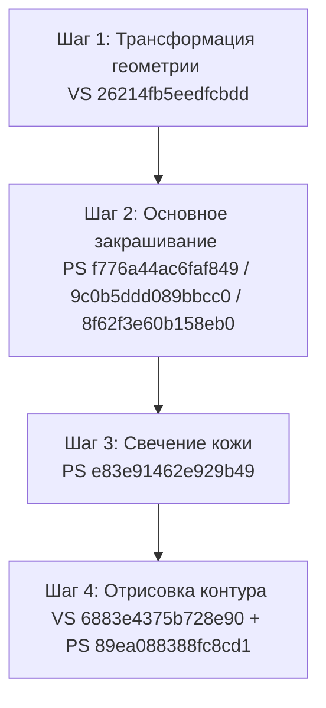

# Исследование шейдеров и конвейера рендеринга Zenless Zone Zero (ZZZ)

В данном документе приводится анализ конвейера рендеринга персонажей Zenless Zone Zero, описание назначения ключевых шейдеров, пруфы их расположения в дампе и рекомендации по их упрощенному воссозданию во вьюпорте RayV-Paint.

---

## 1. Сводная таблица шейдеров

Все шейдеры были извлечены из директории анализа кадра `G:\XXMI\ZZMI\FrameAnalysis-2026-07-10-222027`, глобального кеша ZZMI `G:\XXMI\ZZMI\ShaderCache\` и папки фиксов `G:\XXMI\ZZMI\ShaderFixes\`.

| Хэш шейдера | Тип | Роль в конвейере / Компонент | Источник/Путь в дампе | Формат в `/research/zzz-materials/` |
| :--- | :---: | :--- | :--- | :--- |
| **`26214fb5eedfcbdd`** | VS | Основной вершинный шейдер персонажа | `...\ShaderFixes\26214fb5eedfcbdd-vs_replace.txt` | `.hlsl` (декомпилированный HLSL) |
| **`f776a44ac6faf849`** | PS | Базовый пиксельный шейдер тела/кожи | `...\ShaderAnalyse2\f776a44ac6faf849-ps_replace.txt` | `.hlsl` (декомпилированный HLSL) |
| **`9c0b5ddd089bbcc0`** | PS | Шейдер куртки / одежды (Coat/Torso) | `...\ShaderFixes\9c0b5ddd089bbcc0-ps_replace.txt` | `.hlsl` (декомпилированный HLSL) |
| **`8f62f3e60b158eb0`** | PS | Шейдер волос и ног (Hair/Legs) | `...\ShaderFixes\8f62f3e60b158eb0-ps_replace.txt` | `.hlsl` (декомпилированный HLSL) |
| **`e83e91462e929b49`** | PS | Шейдер размытия/свечения кожи (Bloom) | `...\ShaderCache\e83e91462e929b49-ps_regex.dat` (хэш) | Справочный хэш |
| **`6883e4375b728e90`** | VS | Вершинный шейдер контура (Outline) | `...\ShaderFixes\6883e4375b728e90-vs_replace.txt` | `.hlsl` (декомпилированный HLSL) |
| **`89ea088388fc8cd1`** | PS | Пиксельный шейдер контура и бэклайта | `...\ShaderFixes\89ea088388fc8cd1-ps_replace.txt` | `.hlsl` (декомпилированный HLSL) |

---

## 2. Анализ этапов конвейера рендеринга (Render Pipeline)

Рендеринг персонажа в игре выполняется в несколько последовательных проходов (passes). Ниже восстановлен их порядок:

### Шаг 1: Вершинный проход геометрии (Vertex Shader)
*   **Используемый шейдер:** `26214fb5eedfcbdd` (VS)
*   **Описание:** Это **глобальный вершинный шейдер** для всех персонажей. Он преобразует локальные координаты вершин в clip space с учетом матриц трансформации, а также интерполирует UV-координаты, нормали, тангенты и битангенты для пиксельных шейдеров.
*   **Эффект отключения:** Отключение этого шейдера полностью выключает отрисовку мешей персонажей в открытом мире, оставляя видимым только силуэтное свечение (бэклайт), рассчитываемое на последующих проходах контура.
*   **Особая логика ZZZ:** Именно этот шейдер считывает проекции нормалей контура из `TEXCOORD1` (упакованные экспортером XXMI нормали контура в тангент-пространство меша) и передает их дальше по конвейеру.

### Шаг 2: Проход основного шейдинга (Pixel Shader)
На этом этапе меш закрашивается базовыми текстурами и рассчитывается сел-шейдинг освещение. Разные компоненты используют свои пиксельные шейдеры:
1.  **Куртка / Одежда (`9c0b5ddd089bbcc0`):**
    *   Считывает диффузную карту (`t3`), карту нормалей (`t4`), карту света/бликов (`t5`) и карту материалов (`t6`).
    *   Производит расчет жестких теней (toon shading), металлических отражений и микродеталей ткани.
2.  **Волосы и Ноги (`8f62f3e60b158eb0`):**
    *   Специализированный шейдер волос (анизотропный блик в форме кольца) и градиента кожи/ткани для эффекта капрона на ногах (стоккинг-эффект, рассчитываемый по Fresnel).
3.  **Тело / Кожа (`f776a44ac6faf849`):**
    *   Базовое закрашивание кожи лица и тела с мягким полутоновым переходом (Subsurface Scattering approximation) для предотвращения грязных теней на лице персонажа.

### Шаг 3: Пост-обработка кожи (Bloom / Blur)
*   **Используемый шейдер:** `e83e91462e929b49` (PS)
*   **Описание:** Выполняет размытие маски кожи во второй буфер кадра для создания мягкого эффекта свечения (skin bloom). Отключение этого шейдера убирает свечение кожи, делая ее плоской и матовой.

### Шаг 4: Проход отрисовки контура (Outline Pass)
Отрисовка мультяшного обвода вокруг персонажа. Выполняется методом выдавливания задних граней меша:
1.  **Вершинный шейдер контура (`6883e4375b728e90`):**
    *   Рендерит геометрию с обратным отсечением граней (`Cull Front`).
    *   Считывает проекции нормалей из `TEXCOORD1` и расширяет вершины вдоль направления камеры и нормалей на величину, заданную в константном буфере (толщина контура).
2.  **Пиксельный шейдер контура и бэклайта (`89ea088388fc8cd1`):**
    *   Закрашивает выдавленный контур в темный цвет (на основе диффузной карты).
    *   Дополнительно отвечает за расчет силуэтного свечения (backlight/rim light) по краям персонажа. При отключении основного рендера персонажа (`26214fb5eedfcbdd`) именно этот проход оставляет светящийся контур-силуэт.

---

## 3. Рекомендации по упрощению для 3D-предпросмотра (RayV-Paint)

Поскольку целью 3D-вьюпорта в RayV-Paint является **быстрый предпросмотр текстур** при их рисовании, а не точное воссоздание игрового рендера, конвейер можно существенно упростить:

1.  **Игнорирование скининга и блендинга:**
    *   Вьюпорту не требуется загружать `*Blend.buf` и обрабатывать анимационные веса. Модель отображается в статичной T-позе (или позе экспорта).
2.  **Пропуск пост-эффектов (Bloom):**
    *   Шейдер `e83e91462e929b49` (Bloom кожи) можно полностью исключить из пайплайна.
3.  **Заглушка для Constant Buffers (CB):**
    *   Вместо сложной логики постоянных буферов игры, значения для матриц (`World`, `View`, `Projection`), вектора освещения и настроек контура передаются напрямую из интерфейса редактора.
4.  **Упрощенный расчет контура:**
    *   Вместо полноценного двухпроходного рендера контура с выдавливанием, во вьюпорте можно использовать классический шейдер обводки на основе выборки глубины (Edge Detection в экранном пространстве) или базовый однопроходный контур, если производительность критична.
5.  **Чтение DDS текстур:**
    *   Текстуры, прописанные в `Belle.ini` (такие как `BodyDiffuse.dds`, `BodyNormalMap.dds`), должны биндиться на соответствующие текстурные слоты (`t0`, `t3`, `t4` и т.д.) пиксельных шейдеров согласно разметке в декомпилированных шейдерах.
